# Como autenticar o [Streams for Apache Kafka Console](https://docs.redhat.com/en/documentation/red_hat_streams_for_apache_kafka/3.1/html-single/using_the_streams_for_apache_kafka_console/index) com [Red Hat build of Keycloak (RHBK)](https://docs.redhat.com/en/documentation/red_hat_build_of_keycloak/26.4/html/server_administration_guide/assembly-managing-clients_server_administration_guide)

## Objetivo

Este guia mostra, de forma **direta, intuitiva e prática**, como configurar o **Red Hat build of Keycloak (RHBK)** para autenticar usuários no **Streams for Apache Kafka Console** usando **OIDC**. A autenticação da interface pode ser integrada com um provedor OIDC, e a autorização pode ser feita por grupos usando `security.oidc`, `subjects` e `roles` no recurso `Console` [Source](https://docs.redhat.com/en/documentation/red_hat_streams_for_apache_kafka/3.1/html-single/using_the_streams_for_apache_kafka_console/index)

Este passo a passo foi pensado para um cenário **mínimo e funcional**:

- 1 realm
- 1 client OIDC
- 1 usuário de teste
- 1 grupo de autorização
- 1 Console apontando para o Keycloak

---

## O que você vai configurar

Ao final deste guia, você terá:

- um **realm** no RHBK
- um **usuário simples** para teste
- um **grupo** para autorização
- um **client OIDC** para o Console
- um **mapper** para enviar `groups` no token
- um **Secret** no OpenShift com o `client_secret`
- um recurso **Console** com autenticação OIDC ativada

---

## Pré-requisitos

Antes de começar, garanta que você tem:

- acesso ao **RHBK Admin Console**
- acesso ao cluster **OpenShift**
- o comando `oc` configurado
- o **Streams for Apache Kafka Console** já instalado
- um namespace onde o Console roda
- a URL pública do Console
- a URL pública do Keycloak

A documentação do Console descreve a implantação e a configuração por meio do recurso `Console` aplicado com `oc apply` [Source](https://docs.redhat.com/en/documentation/red_hat_streams_for_apache_kafka/3.1/html-single/using_the_streams_for_apache_kafka_console/index)

---

## Visão geral do passo a passo

Você vai seguir esta ordem:

1. Criar o realm no RHBK
2. Criar um grupo e um usuário simples
3. Criar o client OIDC do Console
4. Configurar o mapper para enviar `groups`
5. Copiar o client secret
6. Criar o Secret no OpenShift
7. Configurar o recurso `Console`
8. Aplicar a configuração
9. Testar o login

---

# 1) Crie um realm no RHBK

No Admin Console do RHBK:

1. Crie um realm  
   Exemplo: `kafka`

   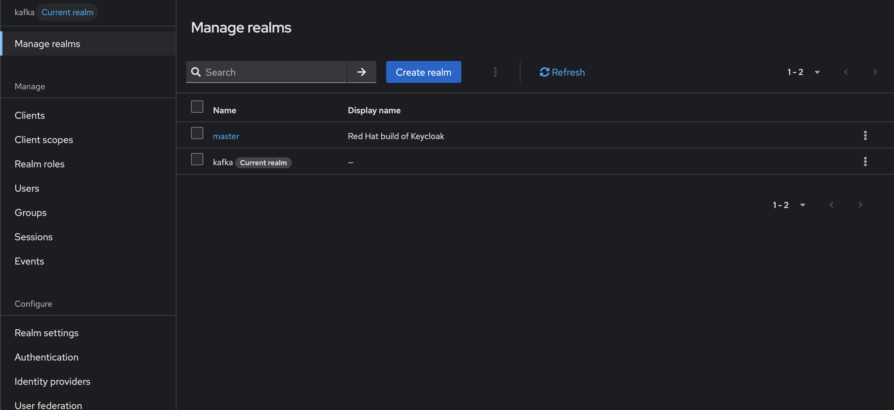

3. Crie os grupos que serão usados no Console  
   Exemplo:
   - `developers`
   - `administrators`

   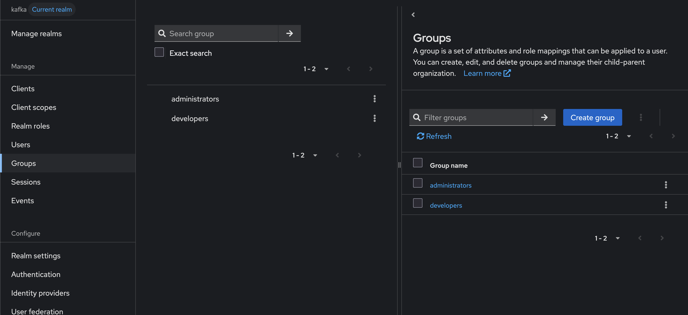

4. Atribua roles aos grupos definidos

   

5. Crie ou importe os usuários
   
   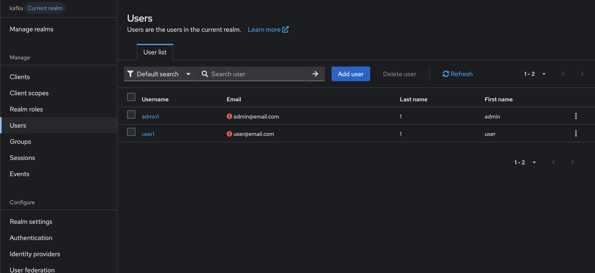

6. Coloque cada usuário no grupo correto

No RHBK, grupos são hierárquicos e usuários podem herdar atributos e permissões dos grupos pai, o que ajuda bastante quando você quer administrar acesso por equipe em vez de usuário por usuário [Source](https://docs.redhat.com/en/documentation/red_hat_build_of_keycloak/26.0/html/server_administration_guide/assigning_permissions_using_roles_and_groups)

   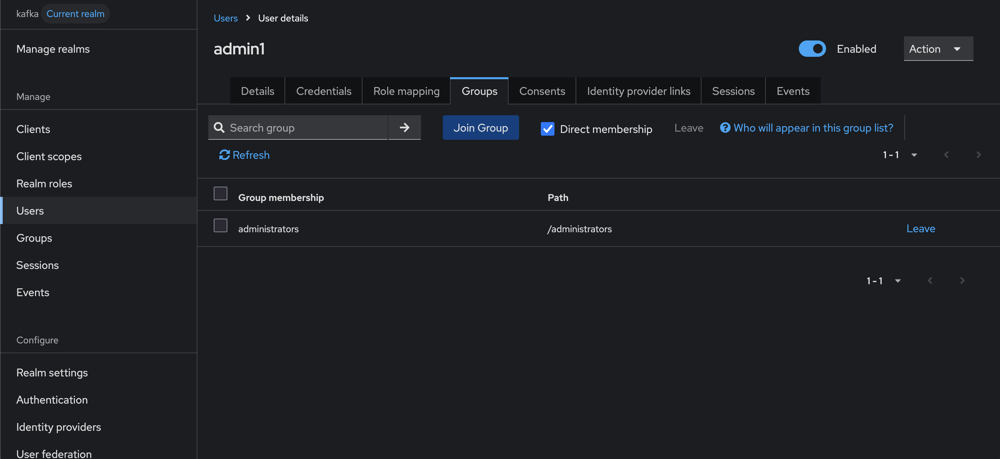

---

# 2) Crie um usuário simples para teste

Para validar a integração, crie um usuário básico.

## Exemplo de usuário

- **Username:** `admin1`
- **Senha:** `admin`
- **Grupo:** `administrators`

> Para um primeiro teste, usar apenas o grupo `administrators` costuma ser o caminho mais simples.

   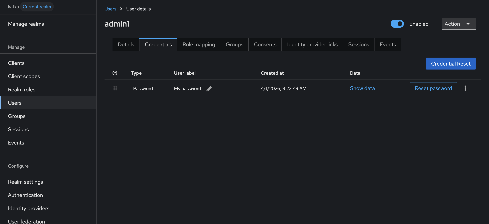

---

# 3) Crie o client OIDC do Console no RHBK

No realm `kafka`:

1. Vá em **Clients**
2. Clique em **Create client**
3. Deixe **Client type = OpenID Connect**
4. Defina:
   - **Client ID:** `streams-console`
   - **Name:** `Streams Console`
5. Clique em **Save**

    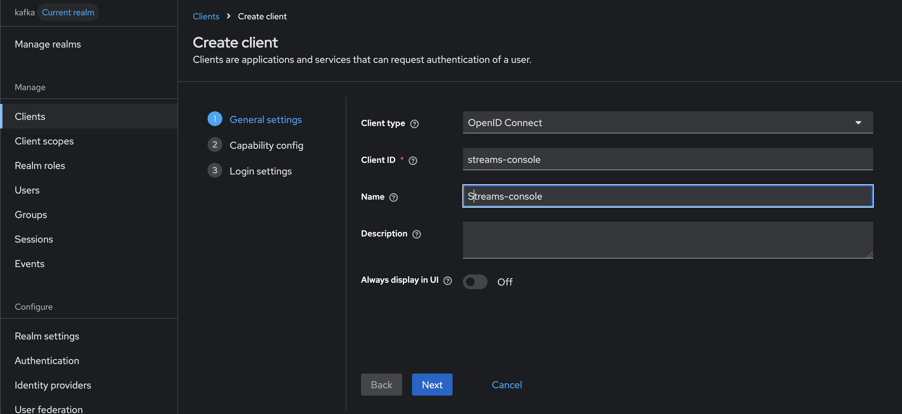

Depois, na aba **Settings**, configure o seguinte:

## Configurações obrigatórias

### Client authentication = ON

Isso transforma o client em um client confidencial, adequado para aplicações server-side que usam `client_secret` [Source](https://docs.redhat.com/en/documentation/red_hat_build_of_keycloak/26.4/html/server_administration_guide/assembly-managing-clients_server_administration_guide)

### Standard Flow = ON

Esse é o fluxo recomendado para login por navegador usando OIDC [Source](https://docs.redhat.com/en/documentation/red_hat_build_of_keycloak/26.4/html/server_administration_guide/assembly-managing-clients_server_administration_guide)

   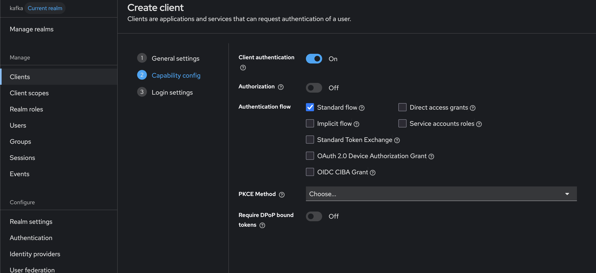


### Valid Redirect URIs

Cadastre a URI de callback usada pelo Console.

## Exemplo

```text
https://my-console.apps.exemplo.com/api/auth/callback/oidc
```

O RHBK faz comparação exata e sensível a maiúsculas/minúsculas para `Valid Redirect URIs`, então evite curingas muito amplos em produção [Source](https://docs.redhat.com/en/documentation/red_hat_build_of_keycloak/26.4/html/server_administration_guide/assembly-managing-clients_server_administration_guide)

### Web Origins

Cadastre a origem pública do Console.

## Exemplo

```text
https://my-console.apps.exemplo.com
```

Isso ajuda a evitar problemas de CORS no navegador [Source](https://docs.redhat.com/en/documentation/red_hat_build_of_keycloak/26.4/html/server_administration_guide/assembly-managing-clients_server_administration_guide)

   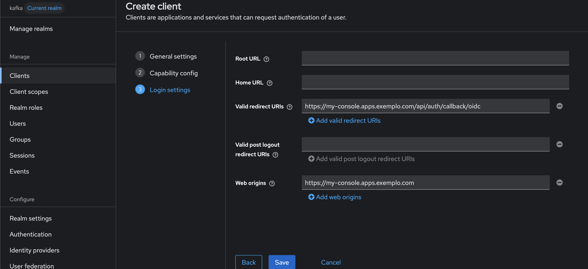

> **Dica importante:** em ambiente produtivo, use sempre **HTTPS** para as URLs do client. O guia do RHBK recomenda isso para fluxos baseados em redirecionamento [Source](https://docs.redhat.com/en/documentation/red_hat_build_of_keycloak/26.0/html/securing_applications_and_services_guide/oidc-layers-)

---

# 4) Faça o RHBK enviar o claim `groups` no token

O Console consegue autorizar usuários com base no claim `groups`. Para isso, o token emitido pelo RHBK precisa conter esse claim. A documentação do Console menciona explicitamente que a autorização baseada em grupo depende de um claim como `groups` no token [Source](https://docs.redhat.com/en/documentation/red_hat_streams_for_apache_kafka/3.1/html-single/using_the_streams_for_apache_kafka_console/index)

No RHBK, faça assim:

1. Abra o client `streams-console`
2. Vá em **Client Scopes**
3. Edite o escopo dedicado do client  
   Exemplo: `streams-console-dedicated`
   
   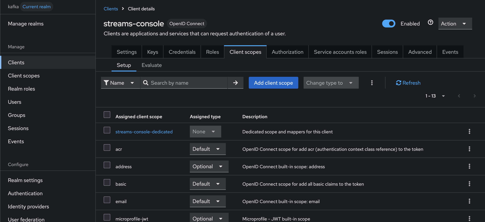
   
5. Vá em **Mappers**
   `Configure a new mapper`

   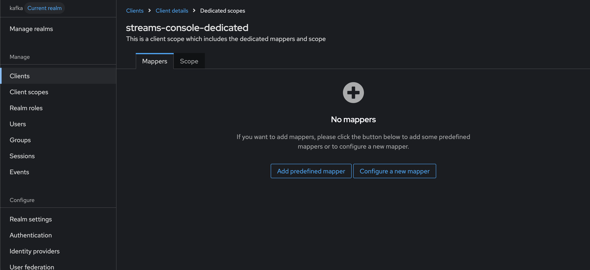
   
6. Adicione um mapper do tipo **Group Membership**

   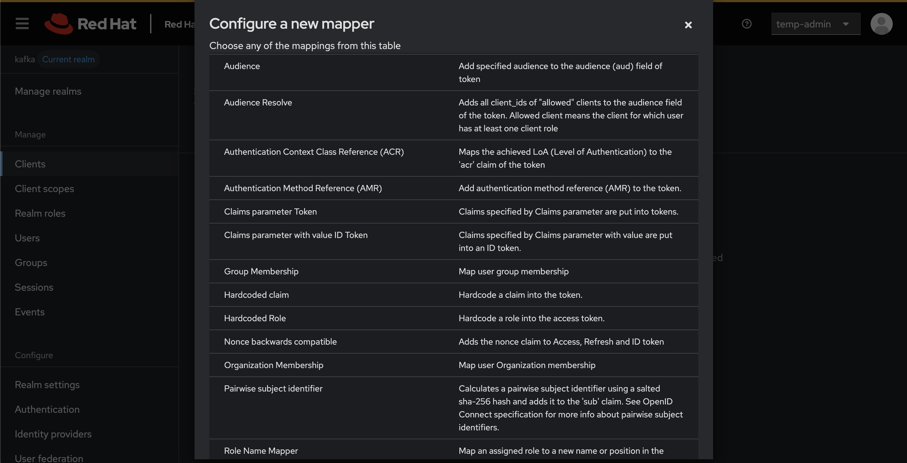
   
7. Configure:
   - **Token Claim Name** = `groups`
   - **Full group path** = **OFF**
  
   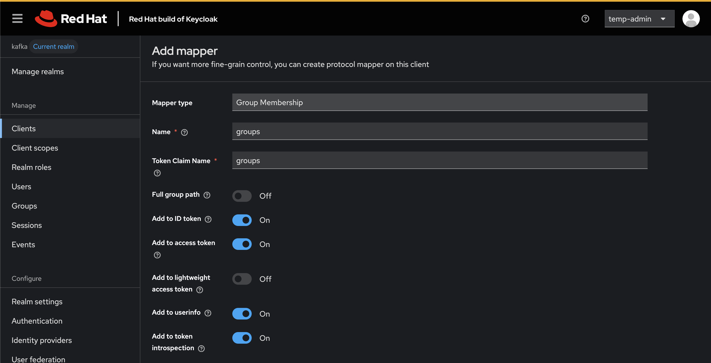
     
8. Salve

Esse é o padrão recomendado para expor grupos como claim `groups` sem enviar o caminho completo do grupo [Source](https://docs.redhat.com/en/documentation/red_hat_satellite/6.18/html/configuring_authentication_for_red_hat_satellite_users/index)

> **Importante:**  
> Se o token vier com valores como `"/administrators"` ou `"/kafka-admins"`, isso normalmente significa que a opção **Full group path** está ligada. Nesse caso:
>
> - ou você desliga **Full group path**
> - ou ajusta o `subjects.include` no Console para usar exatamente o valor do token

---

# 5) Copie o client secret do RHBK

Como o Console usa `clientId` + `clientSecret`, pegue o secret do client criado.

No RHBK:

1. Abra o client `streams-console`
2. Vá na aba **Credentials**
3. Copie o valor do **Client Secret**

   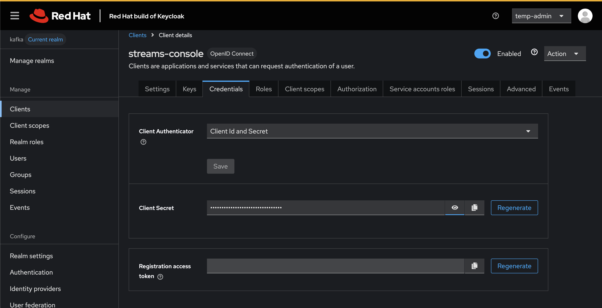

Clientes confidenciais usam `client_secret` por padrão no RHBK [Source](https://docs.redhat.com/en/documentation/red_hat_build_of_keycloak/26.4/html/server_administration_guide/assembly-managing-clients_server_administration_guide)

---

# 6) Crie o Secret no OpenShift com o client secret

No namespace onde o Console está rodando, crie um Secret para armazenar o `client_secret`.

```bash
oc create secret generic my-oidc-secret \
  --from-literal=client-secret='<SEU_CLIENT_SECRET>' \
  -n <namespace-da-console>
```

O modelo oficial do Console usa esse mesmo padrão com `valueFrom.secretKeyRef` [Source](https://docs.redhat.com/en/documentation/red_hat_streams_for_apache_kafka/3.1/html-single/using_the_streams_for_apache_kafka_console/index)

---

# 7) Configure o recurso `Console`

Agora crie o YAML do Console com autenticação OIDC.

utilize como exemplo o arquivo [infra/01-kafka/kafka-console.yaml](https://github.com/ldossant-tech/Como-autenticar-stream-for-apache-kafka-console-com-RHBK/blob/4e0133f2a1414c84c550fec5d057ad808b3b6c45/infra/01-kafka/kafka-console.yaml)

Esse modelo segue a estrutura oficial do Console:

- `security.oidc` define o provedor OIDC
- `subjects` mapeia claims ou usuários para papéis
- `roles` define o que cada papel pode fazer [Source](https://docs.redhat.com/en/documentation/red_hat_streams_for_apache_kafka/3.1/html-single/using_the_streams_for_apache_kafka_console/index)

> Se você quiser permissões mais finas, pode restringir `resources`, `resourceNames` e `privileges`. A documentação do Console mostra exemplos com filtros por nome, wildcard e regex [Source](https://docs.redhat.com/en/documentation/red_hat_streams_for_apache_kafka/3.1/html-single/using_the_streams_for_apache_kafka_console/index)

---

# 8) Salve o arquivo

Salve esse conteúdo em um arquivo chamado, por exemplo:

```text
console-oidc.yaml
```

---

# 9) Aplique a configuração

Execute:

```bash
oc apply -f console-oidc.yaml -n <namespace-da-console>
```

Depois verifique se o pod do Console está rodando:

```bash
oc get pods -n <namespace-da-console>
```

A instalação e a configuração do Console são feitas via recurso `Console`, aplicado com `oc apply` [Source](https://docs.redhat.com/en/documentation/red_hat_streams_for_apache_kafka/3.1/html-single/using_the_streams_for_apache_kafka_console/index)

---

# 11) Teste o login

1. Abra a URL pública do Console
2. Clique para fazer login
3. Autentique com o usuário criado no Keycloak

## Exemplo

- **usuário:** `teste`
- **senha:** `Senha123!`

Se o claim `groups` estiver vindo corretamente no token e o valor estiver alinhado com o `subjects.include`, o usuário entrará no Console com a role configurada [Source](https://docs.redhat.com/en/documentation/red_hat_streams_for_apache_kafka/3.1/html-single/using_the_streams_for_apache_kafka_console/index)

---

# Exemplo mínimo de implementação

## Valores usados no exemplo

- **Realm:** `kafka`
- **Usuário:** `teste`
- **Grupo:** `administrators`
- **Client ID:** `streams-console`

## Resultado esperado

Depois da configuração:

- o usuário `teste` faz login no Keycloak
- o token vem com `groups: ["administrators"]`
- o Console mapeia esse grupo para a role `administrators`
- o usuário consegue acessar os clusters no Console

---

# Checklist de validação

Antes de testar, confirme:

- [ ] O realm foi criado
- [ ] O usuário existe
- [ ] O usuário está no grupo correto
- [ ] O client OIDC foi criado
- [ ] `Client authentication` está **ON**
- [ ] `Standard Flow` está **ON**
- [ ] A Redirect URI está correta
- [ ] O mapper `Group Membership` foi criado
- [ ] `Token Claim Name = groups`
- [ ] `Full group path = OFF`
- [ ] O Secret do OpenShift foi criado
- [ ] O YAML do Console foi aplicado

---

# Problemas comuns

## O usuário autentica, mas recebe 403

Isso normalmente significa que o login funcionou, mas o usuário **não recebeu role** dentro do Console.

Verifique:

- se o token realmente contém `groups`
- se o valor do grupo é exatamente o mesmo usado em `subjects.include`
- se o `Full group path` está desligado no mapper do Keycloak

## O token vem com `/administrators` em vez de `administrators`

Isso indica que o Keycloak está enviando o **path completo do grupo**.  
Desligue **Full group path** no mapper ou ajuste o YAML para usar o valor com `/`.

## O login entra em loop ou falha no callback

Verifique:

- `Valid Redirect URIs`
- `Web Origins`
- URL pública do Console
- URL do realm do Keycloak

---

# Resumo rápido

Se você quiser fazer a implementação mínima, basta garantir estes 4 pontos:

1. Criar o client OIDC no Keycloak
2. Fazer o token sair com `groups`
3. Mapear esse grupo em `subjects`
4. Dar permissão com `roles`

---

# Referências

- [Using the Streams for Apache Kafka Console](https://docs.redhat.com/en/documentation/red_hat_streams_for_apache_kafka/3.1/html-single/using_the_streams_for_apache_kafka_console/index)
- [Managing OpenID Connect and SAML Clients - Red Hat build of Keycloak](https://docs.redhat.com/en/documentation/red_hat_build_of_keycloak/26.4/html/server_administration_guide/assembly-managing-clients_server_administration_guide)
- [Secure applications and services with OpenID Connect - Red Hat build of Keycloak](https://docs.redhat.com/en/documentation/red_hat_build_of_keycloak/26.0/html/securing_applications_and_services_guide/oidc-layers-)
- [Assigning permissions using roles and groups - Red Hat build of Keycloak](https://docs.redhat.com/en/documentation/red_hat_build_of_keycloak/26.0/html/server_administration_guide/assigning_permissions_using_roles_and_groups)
